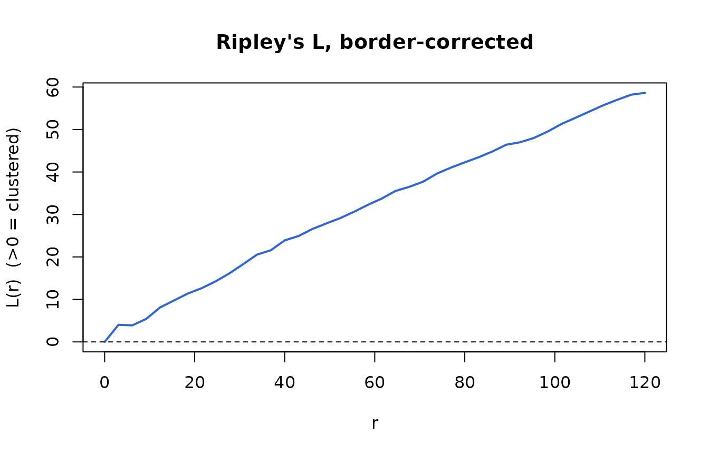
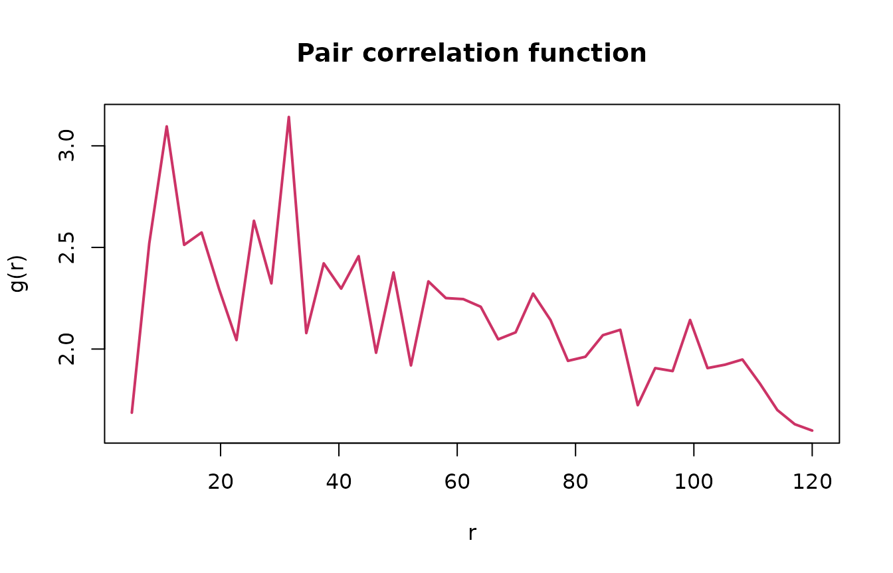
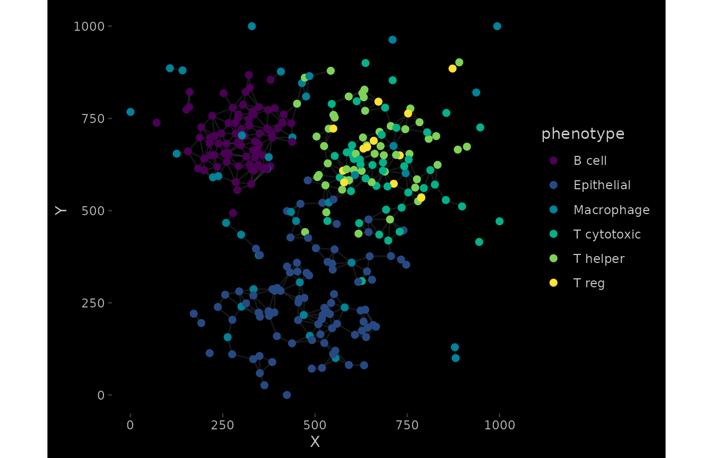
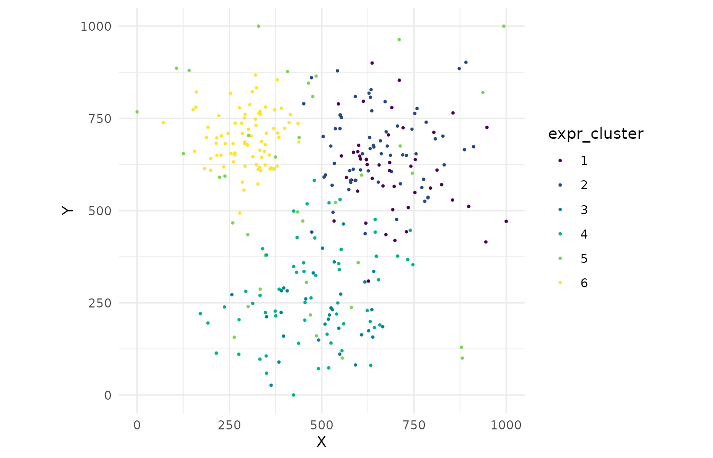

# Advanced Spatial Analysis

[](https://github.com/CTTIR/phenoscapR/actions/workflows/R-CMD-check.yaml)
[](https://cttir.github.io/phenoscapR/)
[](https://CRAN.R-project.org/package=phenoscapR)
[](https://app.codecov.io/gh/CTTIR/phenoscapR?branch=main)
[](https://cran.r-project.org/package=phenoscapR)
[](https://cran.r-project.org/package=phenoscapR)
[](https://opensource.org/licenses/MIT)
[](https://lifecycle.r-lib.org/articles/stages.html#experimental)


## Overview

Beyond nearest neighbours and density, phenoscapR provides a suite of
point- pattern statistics for asking *how* cells are spatially
organised:

- **Neighbourhood enrichment** — do phenotype pairs co-localise more
  than chance?
- **Ripley’s K / L** — clustering or dispersion across many scales at
  once
- **Pair correlation function** — clustering at a *specific* distance
- **Moran’s I** — spatial autocorrelation of a continuous marker
- **Quadrat analysis** — a quick chi-squared test of spatial randomness
- **Cross nearest-neighbour distance** — directed proximity between two
  phenotypes
- **Delaunay network** — the cell-contact graph
- **Expression clustering** — marker-defined communities, ignoring
  position

### One sample at a time

These statistics describe a single point pattern in one observation
window. Pooling several tissues would compute distances across samples
and return nonsense, so phenoscapR **refuses multi-sample objects** for
these functions — subset to one sample first. (Per-cell summaries like
[`FindNeighbours()`](https://cttir.github.io/phenoscapR/reference/FindNeighbours.md),
[`CellDensity()`](https://cttir.github.io/phenoscapR/reference/CellDensity.md),
and
[`InteractionMatrix()`](https://cttir.github.io/phenoscapR/reference/InteractionMatrix.md)
are sample-aware and need no subsetting.)

``` r

library(phenoscapR)
data(phenoscapR_example)

spe <- phenoscapR_example
spe@meta_data$phenotype <- spe@meta_data$phenotype_true

# A single tissue section.
a <- spe[spe$sample_id == "tonsil_A", ]
a
#> A SpatialCellData object
#>   320 cells across 1 sample
#>   Markers: CD3, CD4, CD8, CD20, CD68, ... (8 total) 
#>   Normalised: FALSE 
#>   Phenotypes: 6 
#>   Project: phenoscapR example (tonsil, simulated)
```

## Neighbourhood enrichment

A permutation test: it shuffles phenotype labels many times and asks
whether each phenotype pair is observed as neighbours more (positive z)
or less (negative z) often than the shuffles. The planted B-cell
follicle shows up as strong B–B self-enrichment.

``` r

ne <- NeighbourhoodEnrichment(a, radius = 40, n_perm = 199, seed = 1)
ne[order(-ne$z_score), ][1:6, ]
#> <phenoscapR> Neighbourhood enrichment (permutation test)
#>   top co-localised pairs (by z-score):
#>         from          to   z_score       p_value
#>       B cell      B cell 24.996390 6.691699e-138
#>        T reg    T helper  9.851029  6.784551e-23
#>     T helper       T reg  9.851029  6.784551e-23
#>     T helper T cytotoxic  8.315542  9.133401e-17
#>  T cytotoxic    T helper  8.315542  9.133401e-17
```

## Ripley’s K and L

[`RipleysK()`](https://cttir.github.io/phenoscapR/reference/RipleysK.md)
accumulates, for each radius `r`, the average number of other cells
within `r`, normalised by intensity. Under complete spatial randomness
`K(r) = πr²`; the `L` transform makes departures easy to read
(`L(r) > 0` means clustering). The border correction removes edge bias.

``` r

rk <- RipleysK(a, r_seq = seq(0, 120, length.out = 40), correction = "border")
head(rk)
#> <phenoscapR> Ripley's K / border correction
#>   6 radii from 0 to 15.4
#>   L(r) range: [0, 9.75]  (>0 clustered, <0 dispersed)
#>          r        K        L  expected
#> 1 0.000000   0.0000 0.000000   0.00000
#> 2 3.076923 158.7302 4.031198  29.74289
#> 3 6.153846 317.4603 3.898554 118.97156
#> 4 9.230769 674.6032 5.422997 267.68600

with(rk, {
  plot(r, L, type = "l", lwd = 2, col = "#3366cc",
       xlab = "r", ylab = "L(r)  (>0 = clustered)",
       main = "Ripley's L, border-corrected")
  abline(h = 0, lty = 2)
})
```



## Pair correlation function

[`PairCorrelation()`](https://cttir.github.io/phenoscapR/reference/PairCorrelation.md)
is the scale-resolved companion to Ripley’s K: `g(r) > 1` means more
pairs at distance `r` than expected, `g(r) < 1` means inhibition.

``` r

pcf <- PairCorrelation(a, r_seq = seq(5, 120, length.out = 40))
with(pcf, {
  plot(r, g, type = "l", lwd = 2, col = "#cc3366",
       xlab = "r", ylab = "g(r)", main = "Pair correlation function")
  abline(h = 1, lty = 2)
})
```



## Moran’s I

Spatial autocorrelation of a continuous variable. A lineage marker like
CD20, concentrated in the follicle, autocorrelates strongly (`I` well
above its expectation, tiny p-value).

``` r

MoransI(a, feature = "CD20", radius = 50)
#> <phenoscapR> Moran's I spatial autocorrelation
#>   I = 1.0886   (expected -0.0031 under no autocorrelation)
#>   z = 34.557, p = 1.13e-261
#>   significant positive autocorrelation (clustered)
```

## Quadrat analysis

A fast omnibus test: tile the window into an `nx × ny` grid, count cells
per tile, and compare to a uniform expectation with a chi-squared test.
The variance-to-mean ratio (`VMR`) exceeds 1 for clustered patterns.

``` r

qa <- QuadratAnalysis(a, nx = 5, ny = 5)
qa[c("chi_sq", "p_value", "VMR")]
#> $chi_sq
#> [1] 367.8125
#> 
#> $p_value
#> [1] 2.927953e-63
#> 
#> $VMR
#> [1] 15.32552
```

## Cross nearest-neighbour distance

For each cell of phenotype `from`, the distance to the nearest cell of
phenotype `to` — a directed measure of how close one population sits to
another. It returns one distance per source cell.

``` r

d_help_to_b <- CrossNNDistance(a, from = "T helper", to = "B cell")
summary(d_help_to_b)
#>    Min. 1st Qu.  Median    Mean 3rd Qu.    Max. 
#>   46.52  168.36  203.95  233.43  313.92  484.20
```

## Delaunay contact network

The Delaunay triangulation approximates which cells physically touch.
Capping edge length with `max_edge` drops the long edges that span empty
space.

``` r

a <- DelaunayNetwork(a, max_edge = 60)
nrow(a@spatial$delaunay_edges)
#> [1] 661
SpatialNetworkPlot(a)
```



## Expression clustering

Cluster cells by their normalised marker profiles, independent of
position, then look at where those clusters fall in the tissue.

``` r

a <- ExpressionClusters(a, k = 6)
table(a$expr_cluster)
#> 
#>  1  2  3  4  5  6 
#> 45 67 31 59 38 80
CellMap(a, colour_by = "expr_cluster")
```



## Choosing a statistic

| Question | Use | Output |
|----|----|----|
| Do phenotypes A and B sit together? | [`NeighbourhoodEnrichment()`](https://cttir.github.io/phenoscapR/reference/NeighbourhoodEnrichment.md) | z-score / p per pair |
| Is one phenotype clustered overall? | [`RipleysK()`](https://cttir.github.io/phenoscapR/reference/RipleysK.md) (target =) | K, L vs radius |
| At *what distance* is it clustered? | [`PairCorrelation()`](https://cttir.github.io/phenoscapR/reference/PairCorrelation.md) | g(r) |
| Is a marker spatially autocorrelated? | [`MoransI()`](https://cttir.github.io/phenoscapR/reference/MoransI.md) | I, z, p |
| Quick “is it random?” check | [`QuadratAnalysis()`](https://cttir.github.io/phenoscapR/reference/QuadratAnalysis.md) | chi-sq, VMR |
| How near is A to B? | [`CrossNNDistance()`](https://cttir.github.io/phenoscapR/reference/CrossNNDistance.md) | distances |
| Which cells touch? | [`DelaunayNetwork()`](https://cttir.github.io/phenoscapR/reference/DelaunayNetwork.md) | edge list |
| Marker-defined communities | [`ExpressionClusters()`](https://cttir.github.io/phenoscapR/reference/ExpressionClusters.md) | cluster labels |

All of these run on a kd-tree search engine, so they scale to large
sections; a 20,000-cell tissue completes each statistic in seconds.

## Next steps

- [`?NeighbourhoodEnrichment`](https://cttir.github.io/phenoscapR/reference/NeighbourhoodEnrichment.md),
  [`?RipleysK`](https://cttir.github.io/phenoscapR/reference/RipleysK.md),
  … for full parameter documentation
- Combine with
  [`InteractionMatrix()`](https://cttir.github.io/phenoscapR/reference/InteractionMatrix.md)
  /
  [`InteractionPlot()`](https://cttir.github.io/phenoscapR/reference/InteractionPlot.md)
  for the co-localisation picture
- **[Visualisation
  Gallery](https://cttir.github.io/phenoscapR/articles/phenoscapR-04-visualisation.md)**
  for every plot
