# Visualisation Gallery

[](https://github.com/CTTIR/phenoscapR/actions/workflows/R-CMD-check.yaml)
[](https://cttir.github.io/phenoscapR/)
[](https://CRAN.R-project.org/package=phenoscapR)
[](https://app.codecov.io/gh/CTTIR/phenoscapR?branch=main)
[](https://cran.r-project.org/package=phenoscapR)
[](https://cran.r-project.org/package=phenoscapR)
[](https://opensource.org/licenses/MIT)
[](https://lifecycle.r-lib.org/articles/stages.html#experimental)


## Overview

Every phenoscapR plotting function returns a **ggplot** object, so you
can add themes, facets, or annotations as usual, and they all draw from
the global palette system for consistent colours across a figure panel.
This gallery shows each one on the bundled example data.

``` r

library(phenoscapR)
library(ggplot2)
data(phenoscapR_example)

obj <- phenoscapR_example
obj@meta_data$phenotype <- obj@meta_data$phenotype_true
obj <- NormaliseData(obj, method = "zscore")
obj <- CellDensity(obj, radius = 40)

# A single tissue for the spatial maps.
a <- obj[obj$sample_id == "tonsil_A", ]
markers <- c("CD20", "CD3", "CD8", "PanCK")
```

## Tissue maps

### `CellMap()` — phenotype map

``` r

CellMap(a)
```

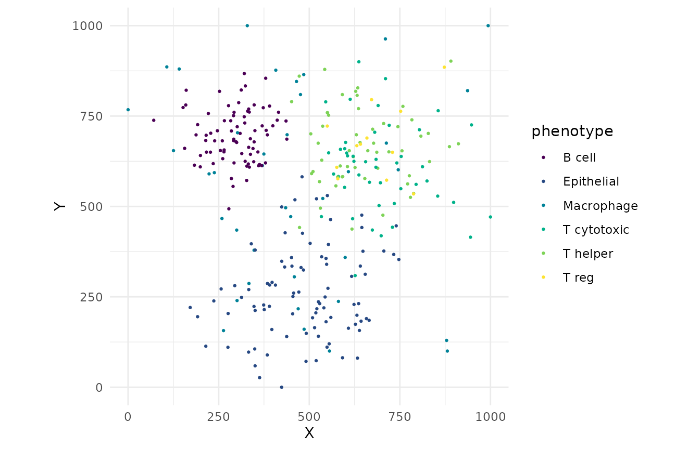

### `FeaturePlot()` — marker intensity in space

``` r

FeaturePlot(a, features = markers)
```

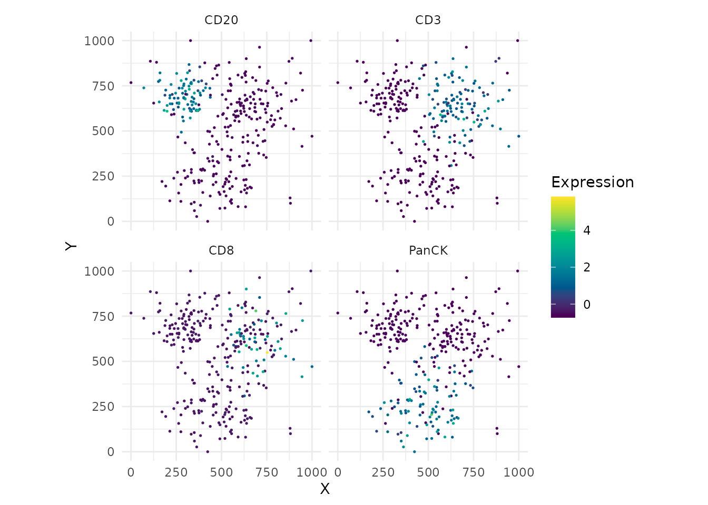

### `DensityPlot()` — local cell density

``` r

DensityPlot(a)
```

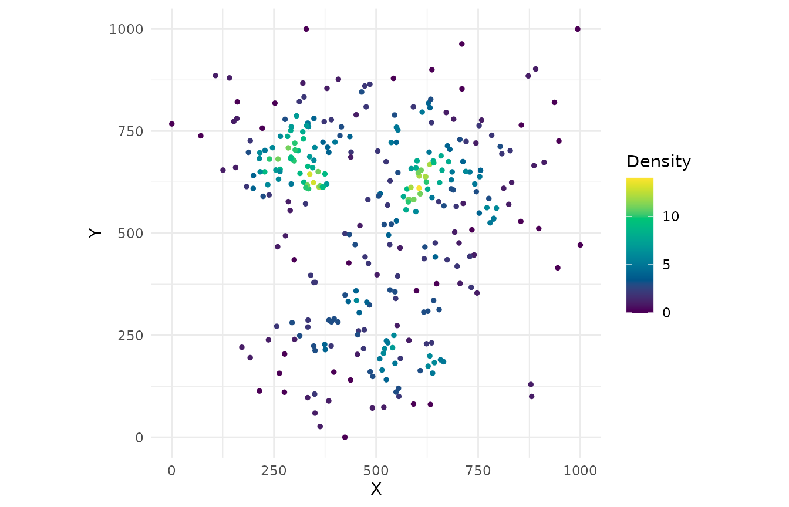

### `SpatialNetworkPlot()` — cell-contact graph

``` r

a_net <- DelaunayNetwork(a, max_edge = 60)
SpatialNetworkPlot(a_net)
```


## Marker distributions

### `ViolinPlot()` and `BoxPlot()`

``` r

ViolinPlot(a, features = markers, group_by = "phenotype")
```

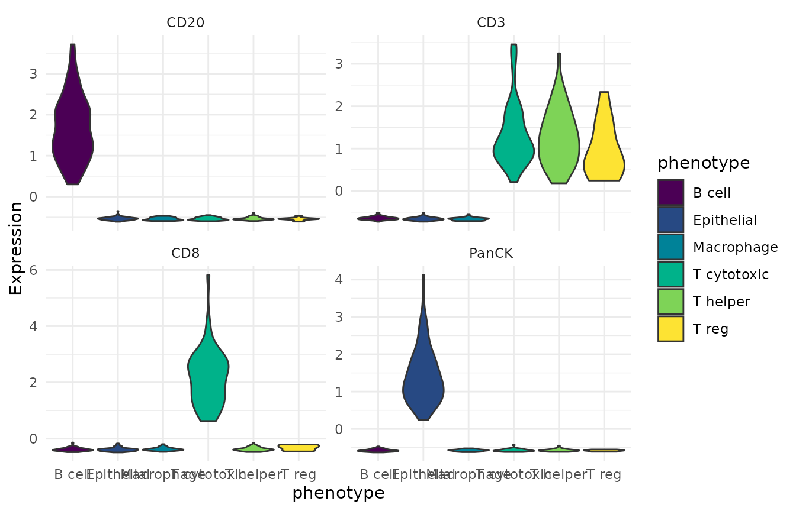

``` r

BoxPlot(a, features = markers, group_by = "phenotype")
```

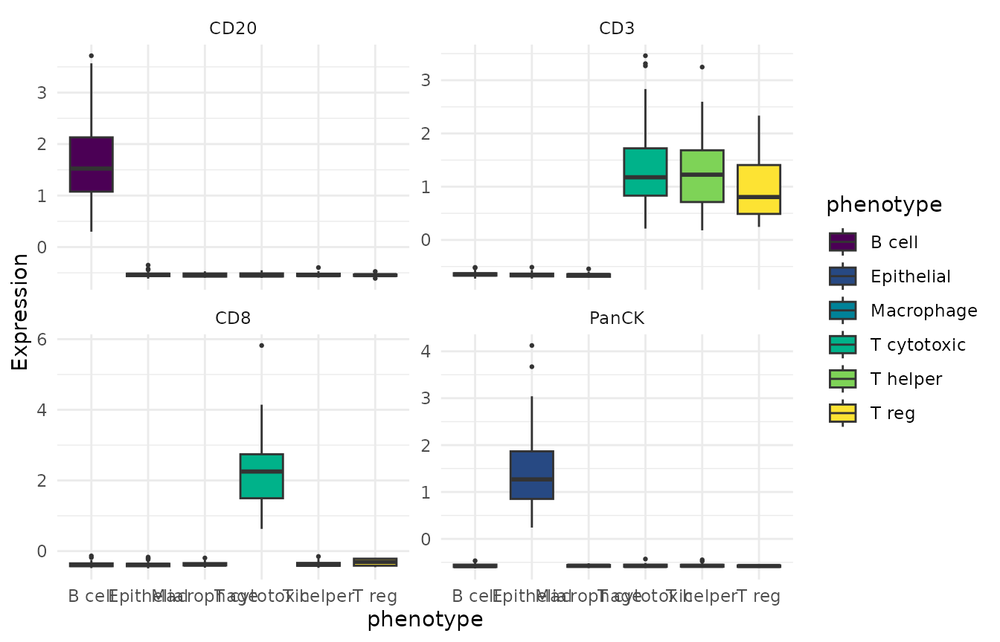

### `RidgePlot()` and `HistogramPlot()`

``` r

RidgePlot(a, features = markers, group_by = "phenotype")
```

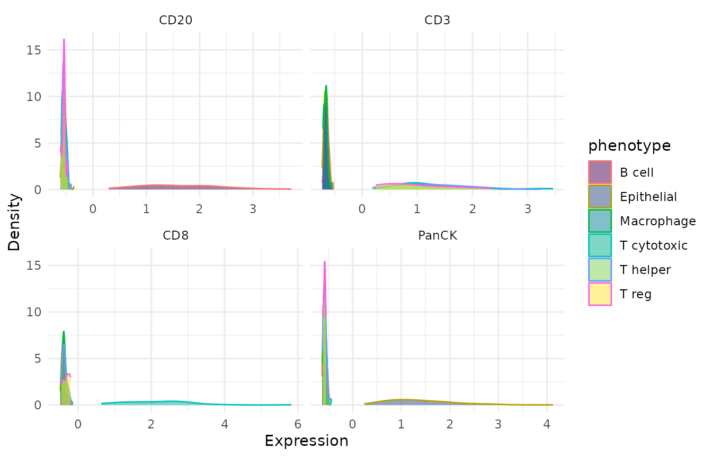

``` r

HistogramPlot(a, feature = "CD20", group_by = "phenotype")
```

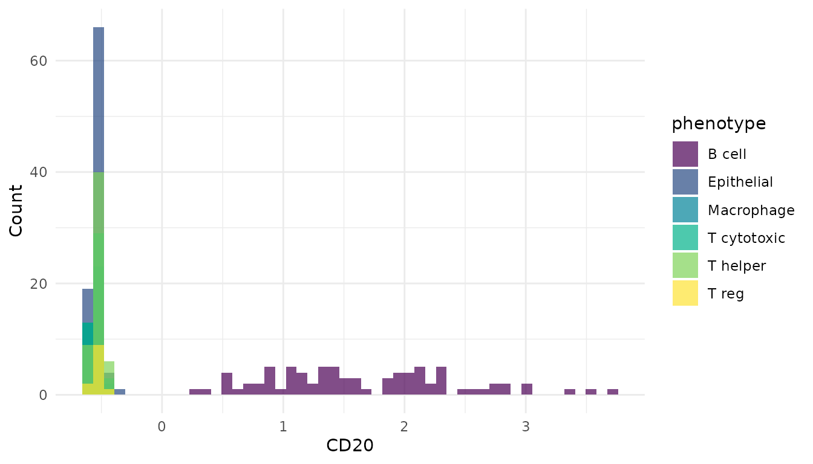

### `DotPlot()` — mean expression × fraction expressing

``` r

DotPlot(a, features = c("CD3", "CD4", "CD8", "CD20", "CD68", "PanCK", "FoxP3"))
```

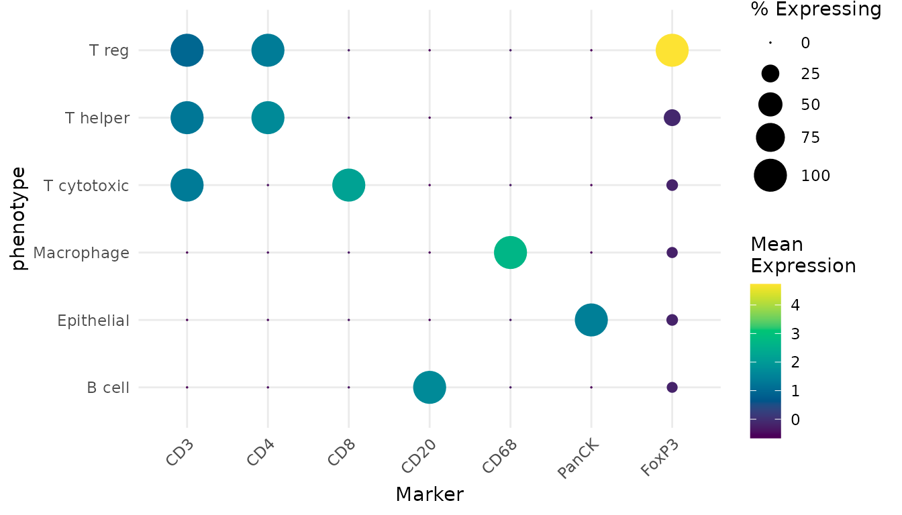

## Summaries

### `MarkerHeatmap()` — phenotype signatures

``` r

MarkerHeatmap(obj)
```

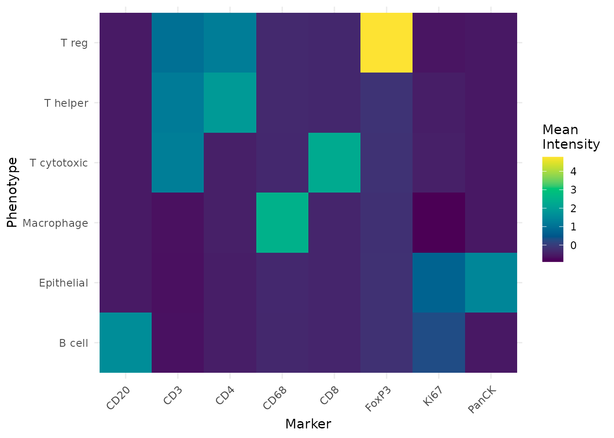

### `CompositionPlot()` — phenotype proportions

``` r

CompositionPlot(obj, group_by = "sample_id")
```

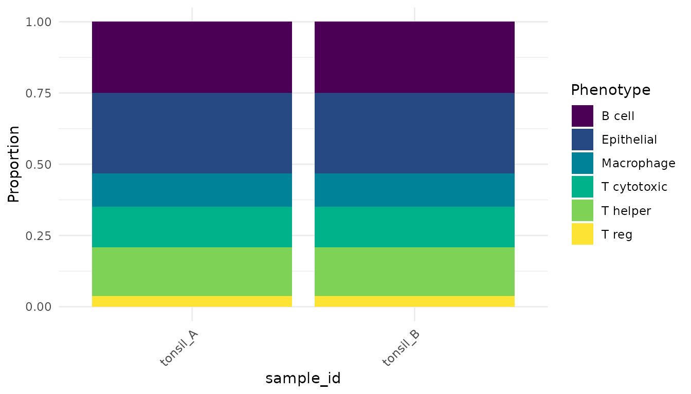

### `InteractionPlot()` — co-localisation scores

``` r

InteractionPlot(InteractionMatrix(obj, radius = 40))
```

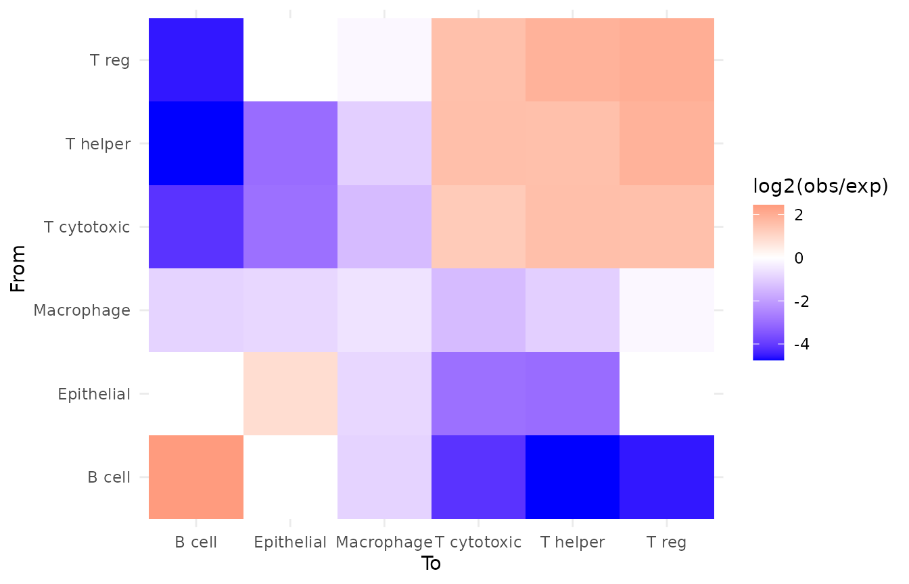

### `QCPlot()` — any metadata pair

``` r

QCPlot(a, x = "cell_area", y = "density", colour_by = "phenotype")
```

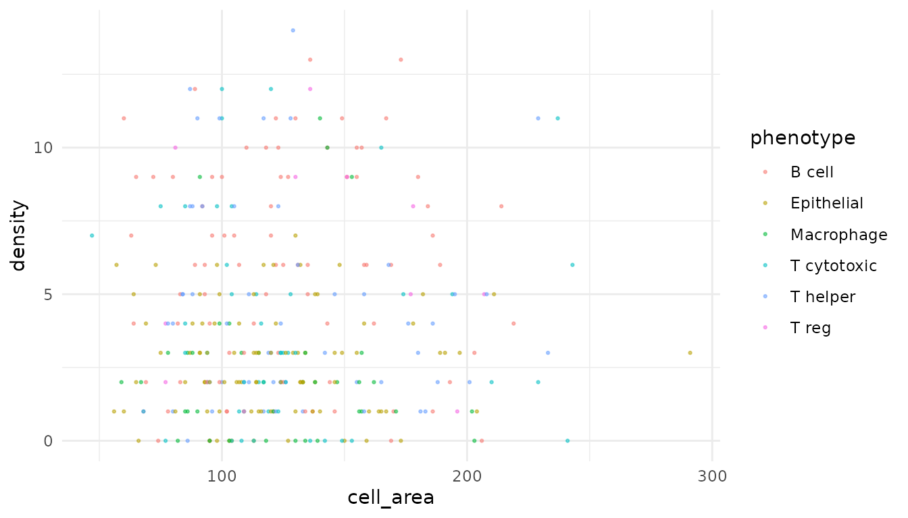

## Dimensionality reductions

Reduce marker space and plot it with
[`DimPlot()`](https://cttir.github.io/phenoscapR/reference/EmbeddingPlot.md)
/
[`EmbeddingPlot()`](https://cttir.github.io/phenoscapR/reference/EmbeddingPlot.md).

``` r

obj <- RunPCA(obj, n_pcs = 10)
DimPlot(obj, reduction = "pca", colour_by = "phenotype")
```

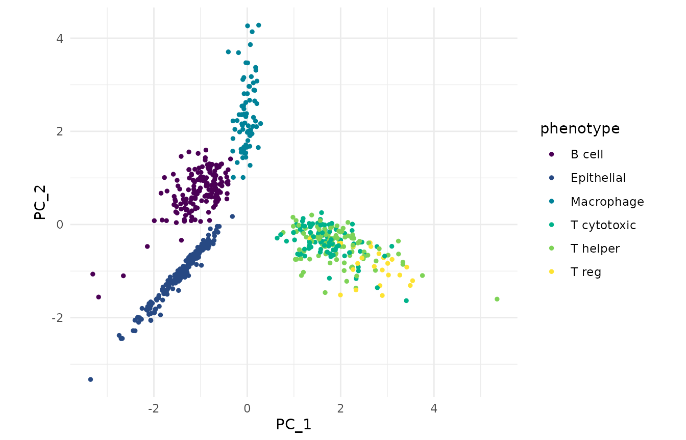

``` r

obj <- RunUMAP(obj, dims = 10, n_neighbors = 15)
EmbeddingPlot(obj, reduction = "umap", colour_by = "phenotype")
```

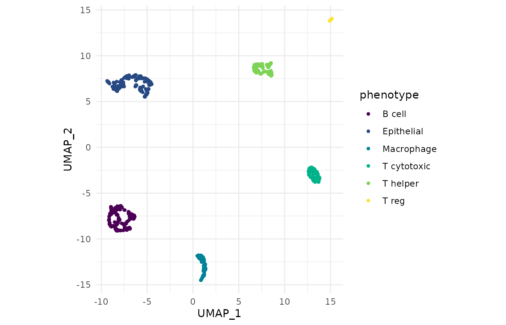

## Theming and palettes

Because each plot is a plain ggplot, standard customisation just works:

``` r

CellMap(a) +
  labs(title = "Tonsil A — phenotype map") +
  theme(plot.title = element_text(face = "bold"))
```

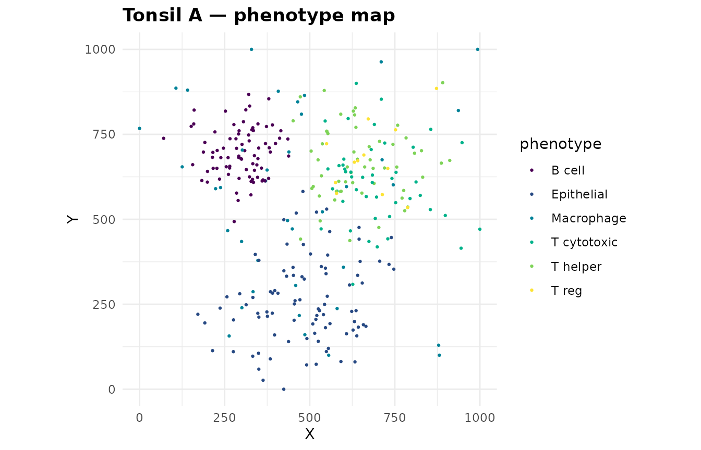

The package palette is global. Set it once and every plot follows. Any
viridis-family option works (`"viridis"`, `"inferno"`, `"plasma"`,
`"cividis"`, `"rocket"`, `"mako"`):

``` r

SetPalette("rocket")
CompositionPlot(obj, group_by = "sample_id")
```

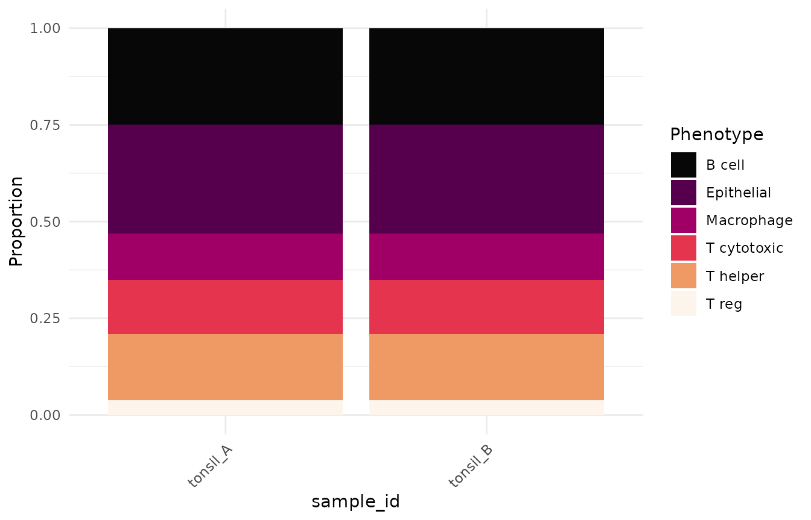

[`PaletteDiscrete()`](https://cttir.github.io/phenoscapR/reference/PaletteDiscrete.md),
[`PaletteContinuous()`](https://cttir.github.io/phenoscapR/reference/PaletteContinuous.md),
and
[`CustomGradient()`](https://cttir.github.io/phenoscapR/reference/CustomGradient.md)
expose the same colours for use in bespoke plots.

``` r

PaletteDiscrete(5)
#> [1] "#4B0055" "#00588B" "#009B95" "#53CC67" "#FDE333"
```

## See also

- **[Getting
  Started](https://cttir.github.io/phenoscapR/articles/phenoscapR.md)**
  — the end-to-end workflow
- **[Advanced Spatial
  Analysis](https://cttir.github.io/phenoscapR/articles/phenoscapR-03-spatial-analysis.md)**
  — the statistics behind these plots
