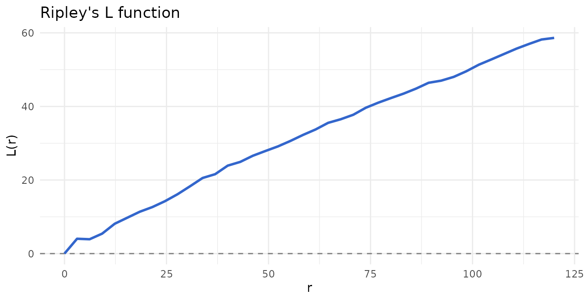
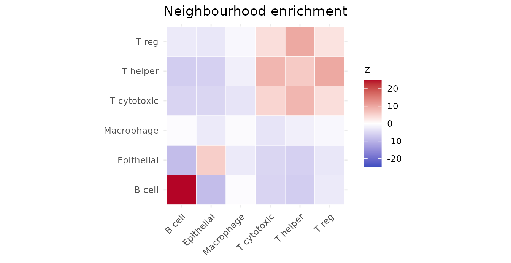
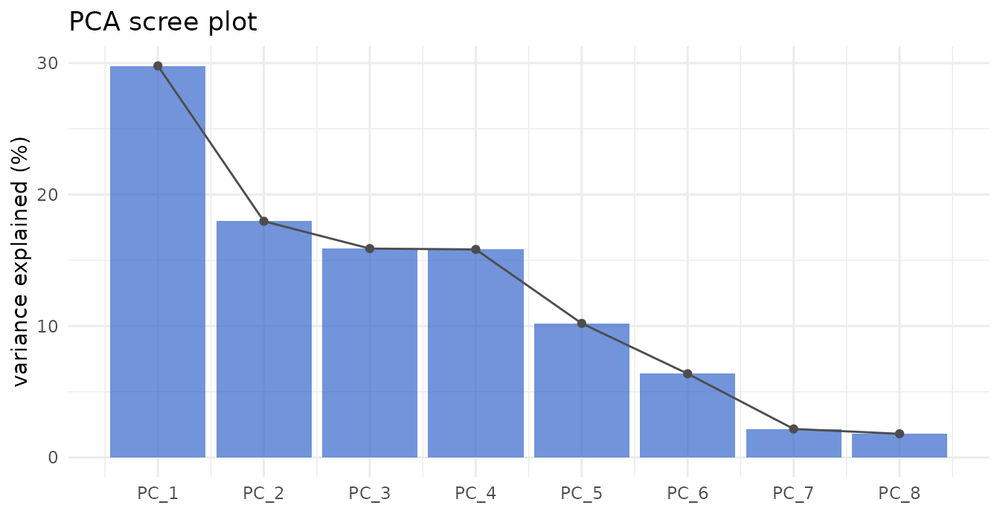
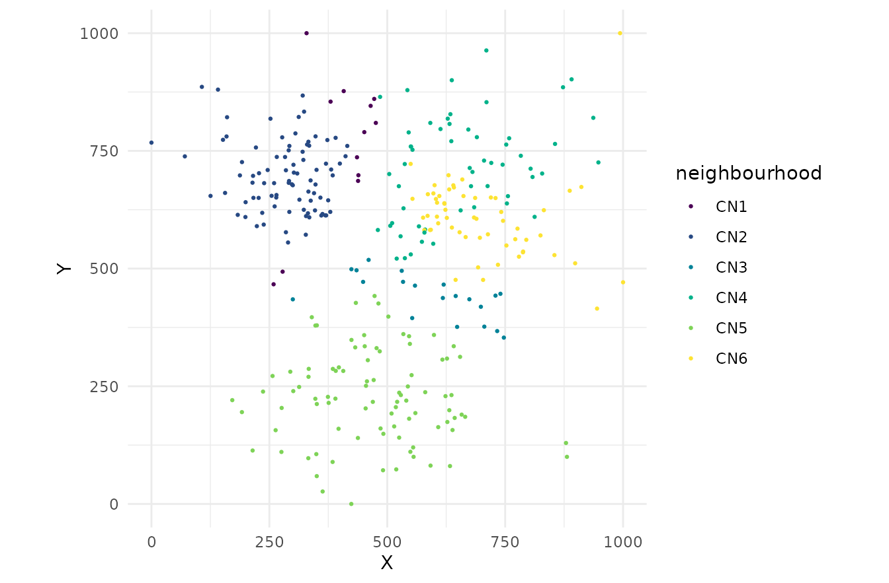
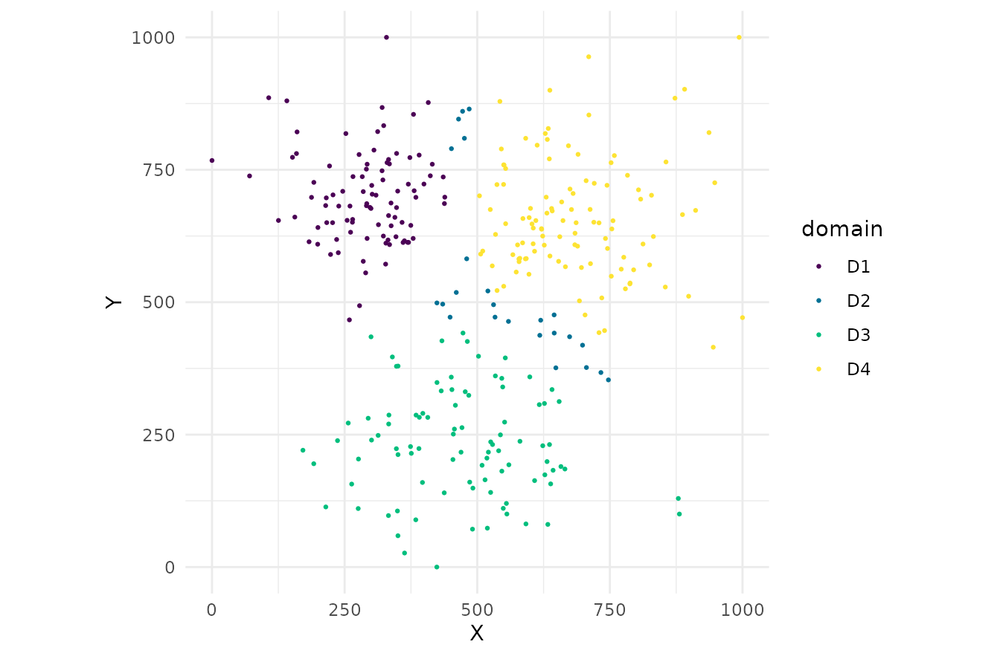

# Advanced Capabilities

[](https://github.com/CTTIR/phenoscapR/actions/workflows/R-CMD-check.yaml)
[](https://cttir.github.io/phenoscapR/)
[](https://CRAN.R-project.org/package=phenoscapR)
[](https://app.codecov.io/gh/CTTIR/phenoscapR?branch=main)
[](https://cran.r-project.org/package=phenoscapR)
[](https://cran.r-project.org/package=phenoscapR)
[](https://opensource.org/licenses/MIT)
[](https://lifecycle.r-lib.org/articles/stages.html#experimental)


This vignette tours the capabilities added beyond the core workflow: a
coherent result API, higher-order spatial structure, rigorous
statistics, unsupervised phenotyping, differential testing, platform
readers, and ecosystem interop.

``` r

library(phenoscapR)
library(ggplot2)
data(phenoscapR_example)

obj <- phenoscapR_example
obj@meta_data$phenotype <- obj@meta_data$phenotype_true
obj <- NormaliseData(obj, "zscore")
a <- obj[obj$sample_id == "tonsil_A", ]
```

## A coherent result API

Every spatial statistic returns a classed object with a tidy `print` and
a one-line
[`autoplot()`](https://ggplot2.tidyverse.org/reference/autoplot.html),
while still behaving like its underlying data frame.

``` r

rk <- RipleysK(a, r_seq = seq(0, 120, length.out = 40), correction = "border")
rk                       # tidy print
#> <phenoscapR> Ripley's K / border correction
#>   40 radii from 0 to 120
#>   L(r) range: [0, 58.6]  (>0 clustered, <0 dispersed)
#>          r        K        L  expected
#> 1 0.000000   0.0000 0.000000   0.00000
#> 2 3.076923 158.7302 4.031198  29.74289
#> 3 6.153846 317.4603 3.898554 118.97156
#> 4 9.230769 674.6032 5.422997 267.68600
head(rk$L)               # ...but still a data frame
#> [1] 0.000000 4.031198 3.898554 5.422997 8.108830 9.746386
```

``` r

autoplot(rk)
```



``` r

autoplot(NeighbourhoodEnrichment(a, radius = 40, n_perm = 199, seed = 1))
```



### Per-sample analysis

The single-window statistics refuse multi-sample objects by default, but
`by_sample = TRUE` maps them across every section and returns a named
list.

``` r

per <- RipleysK(obj, r_seq = seq(0, 100, length.out = 20), by_sample = TRUE)
per
#> <phenoscapR> per-sample results (2 samples)
#>   each element: phenoscapR_ripley
#>   - tonsil_A
#>   - tonsil_B
#> Access a sample with result[["tonsil_A"]].
per[["tonsil_B"]]
#> <phenoscapR> Ripley's K / none correction
#>   20 radii from 0 to 100
#>   L(r) range: [0, 37.4]  (>0 clustered, <0 dispersed)
#>           r         K        L  expected
#> 1  0.000000    0.0000 0.000000   0.00000
#> 2  5.263158  159.1946 1.855354  87.02473
#> 3 10.526316  654.4666 3.907089 348.09891
#> 4 15.789474 1521.1926 6.215313 783.22255
```

## Rigorous statistics

Ripley’s K offers a translation edge correction; Moran’s I offers weight
schemes and a permutation p-value; the interaction matrix offers a
permutation null.

``` r

RipleysK(a, r_seq = seq(0, 100, length.out = 20),
         correction = "translation")$K |> head()
#> [1]    0.0000  254.8305  926.1303 2018.0625 3598.2549 5532.1124

MoransI(a, feature = "CD20", radius = 40, weights = "idw", n_perm = 199,
        seed = 1)
#> <phenoscapR> Moran's I spatial autocorrelation
#>   I = 1.0246   (expected -0.0031 under no autocorrelation)
#>   z = 16.671, p = 0.005
#>   significant positive autocorrelation (clustered)

InteractionMatrix(a, radius = 40, method = "permutation", n_perm = 99,
                  seed = 1) |> head(4)
#> <phenoscapR> Phenotype interaction matrix
#>   1 phenotypes; score = log2(observed / expected)
#>   strongest attractions:
#>    from          to interaction_score
#>  B cell      B cell         2.4380689
#>  B cell  Epithelial         0.0000000
#>  B cell T cytotoxic         0.0000000
#>  B cell  Macrophage        -0.1477536
```

### PCA variance

``` r

obj <- RunPCA(obj, n_pcs = 8)
round(VarianceExplained(obj), 1)
#> PC_1 PC_2 PC_3 PC_4 PC_5 PC_6 PC_7 PC_8 
#> 29.8 18.0 15.9 15.8 10.2  6.4  2.2  1.8
ScreePlot(obj)
```



## Higher-order spatial structure

### Cellular neighbourhoods (niches)

Cluster cells by the phenotype composition of their local neighbourhood.

``` r

obj <- CellularNeighbourhoods(obj, n_neighbourhoods = 6, k = 20, seed = 1)
table(obj$neighbourhood)
#> 
#> CN1 CN2 CN3 CN4 CN5 CN6 
#>  24 164  46 102 181 123
CellMap(obj[obj$sample_id == "tonsil_A", ], colour_by = "neighbourhood")
```



### Spatial domains

Cluster cells by spatially smoothed expression into coherent tissue
regions.

``` r

obj <- SpatialDomains(obj, n_domains = 4, k = 20, seed = 1)
CellMap(obj[obj$sample_id == "tonsil_A", ], colour_by = "domain")
```



## Unsupervised phenotyping

[`ExpressionClusters()`](https://cttir.github.io/phenoscapR/reference/ExpressionClusters.md)
clusters cells by expression (k-means, hierarchical, or a Gaussian
mixture model);
[`AnnotateClusters()`](https://cttir.github.io/phenoscapR/reference/AnnotateClusters.md)
names clusters by their top markers.

``` r

obj <- ExpressionClusters(obj, k = 6, method = "gmm")
#> Package 'mclust' version 6.1.3
#> Type 'citation("mclust")' for citing this R package in publications.
AnnotateClusters(obj, add_column = FALSE)
#>            1            2            3            4            5            6 
#>  "CD20Ki67+"    "CD8CD3+" "PanCKKi67+"      "CD68+"    "CD4CD3+"  "FoxP3CD4+"
```

## Differential abundance

Compare phenotype proportions across conditions, with the sample as the
unit of replication.

``` r

obj@meta_data$arm <- ifelse(obj$sample_id == "tonsil_A", "ctrl", "treat")
DifferentialAbundance(obj, condition = "arm")
#> Warning: Some conditions have fewer than 2 samples; p-values are unreliable.
#> <phenoscapR> Differential abundance (wilcox test)
#>   conditions: ctrl vs treat
#>   0 of 6 phenotypes differ at p_adj < 0.05
#>    phenotype mean_ctrl mean_treat statistic p_value p_adj
#>       B cell  0.250000   0.250000       0.5       1     1
#>   Epithelial  0.281250   0.281250       0.5       1     1
#>   Macrophage  0.118750   0.118750       0.5       1     1
#>  T cytotoxic  0.140625   0.140625       0.5       1     1
#>     T helper  0.171875   0.171875       0.5       1     1
#>        T reg  0.037500   0.037500       0.5       1     1
```

## Platform readers

A general expression-plus-coordinates reader underlies per-vendor
wrappers
([`ReadXenium()`](https://cttir.github.io/phenoscapR/reference/ReadXenium.md),
[`ReadCosMx()`](https://cttir.github.io/phenoscapR/reference/ReadCosMx.md),
[`ReadMERSCOPE()`](https://cttir.github.io/phenoscapR/reference/ReadMERSCOPE.md)).

``` r

expr <- matrix(rpois(40, 5), nrow = 10,
               dimnames = list(NULL, c("CD3", "CD8", "CD20", "PanCK")))
meta <- data.frame(x = runif(10, 0, 100), y = runif(10, 0, 100),
                   region = rep(c("a", "b"), 5))
ReadMatrixCoords(expr, meta)
#> A SpatialCellData object
#>   10 cells across 1 sample
#>   Markers: CD3, CD8, CD20, PanCK 
#>   Normalised: FALSE 
#>   Project: SpatialProject
```

## Ecosystem interop

Convert to and from Seurat and SpatialExperiment.

``` r

se <- as_Seurat(phenoscapR_example)
class(se)
#> [1] "Seurat"
#> attr(,"package")
#> [1] "SeuratObject"
back <- as_SpatialCellData(se)
back
#> A SpatialCellData object
#>   640 cells across 2 samples
#>   Markers: CD3, CD4, CD8, CD20, CD68, ... (8 total) 
#>   Normalised: FALSE 
#>   Project: SpatialProject
```

## See also

- [Getting
  Started](https://cttir.github.io/phenoscapR/articles/phenoscapR.md) –
  the core workflow
- [Advanced Spatial
  Analysis](https://cttir.github.io/phenoscapR/articles/phenoscapR-03-spatial-analysis.md)
  – the statistics
- [Visualisation
  Gallery](https://cttir.github.io/phenoscapR/articles/phenoscapR-04-visualisation.md)
  – every plot
