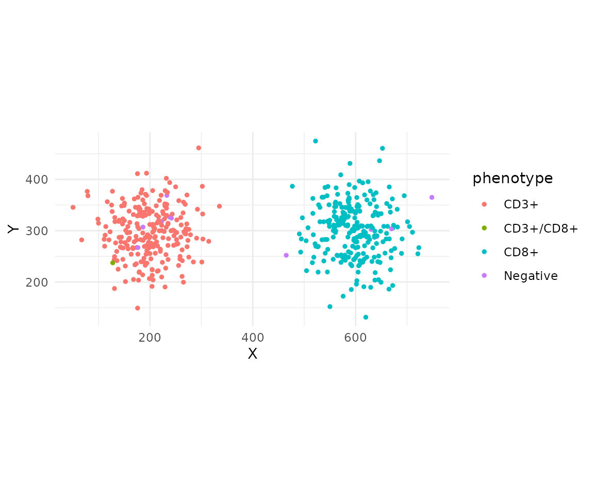
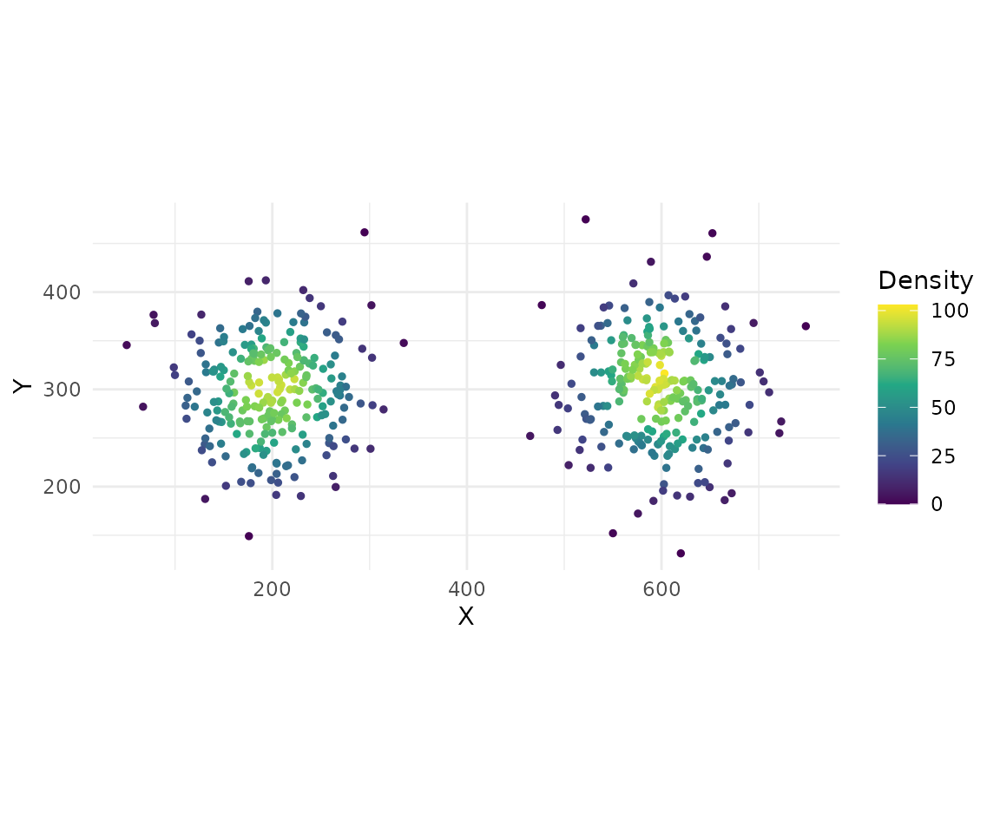

# Getting Started with phenoscapR


## Overview

**phenoscapR** provides tools for reading, processing, analysing, and
visualising single-cell spatial biology data from multiplexed imaging
platforms.

A typical workflow involves:

1.  **Reading** cell segmentation data with
    [`read_spatial()`](https://r-heller.github.io/phenoscapR/reference/read_spatial.md)
2.  **Quality control** with
    [`qc_filter()`](https://r-heller.github.io/phenoscapR/reference/qc_filter.md)
3.  **Normalisation** with
    [`normalise_markers()`](https://r-heller.github.io/phenoscapR/reference/normalise_markers.md)
4.  **Phenotyping** with
    [`phenotype_cells()`](https://r-heller.github.io/phenoscapR/reference/phenotype_cells.md)
5.  **Spatial analysis** with
    [`nearest_neighbours()`](https://r-heller.github.io/phenoscapR/reference/nearest_neighbours.md),
    [`cell_density()`](https://r-heller.github.io/phenoscapR/reference/cell_density.md),
    [`interaction_matrix()`](https://r-heller.github.io/phenoscapR/reference/interaction_matrix.md),
    and
    [`spatial_clusters()`](https://r-heller.github.io/phenoscapR/reference/spatial_clusters.md)
6.  **Visualisation** with
    [`plot_cell_map()`](https://r-heller.github.io/phenoscapR/reference/plot_cell_map.md),
    [`plot_density()`](https://r-heller.github.io/phenoscapR/reference/plot_density.md),
    [`plot_heatmap()`](https://r-heller.github.io/phenoscapR/reference/plot_heatmap.md),
    and
    [`plot_interactions()`](https://r-heller.github.io/phenoscapR/reference/plot_interactions.md)

## Creating Example Data

Since real cell segmentation files can be large, we will create a small
simulated data set for illustration.

``` r

library(phenoscapR)

set.seed(42)
n_cells <- 500

# Simulate two cell populations in different spatial regions
dt <- data.table::data.table(
  `Cell ID` = seq_len(n_cells),
  `Cell X Position` = c(rnorm(250, 200, 50), rnorm(250, 600, 50)),
  `Cell Y Position` = c(rnorm(250, 300, 50), rnorm(250, 300, 50)),
  `Cell Area (px)` = rlnorm(n_cells, log(100), 0.3),
  CD3 = c(rnorm(250, 800, 150), rnorm(250, 200, 100)),
  CD8 = c(rnorm(250, 200, 100), rnorm(250, 700, 120)),
  DAPI = rnorm(n_cells, 1000, 200)
)

# Write to a temporary CSV
tmp <- tempfile(fileext = ".csv")
write.csv(dt, tmp, row.names = FALSE)
```

## Reading Data

``` r

cells <- read_spatial(tmp, sample_id = "example")
head(cells)
#>    sample_id cell_id        x        y cell_area      CD3         CD8      DAPI
#>       <char>   <int>    <num>    <num>     <num>    <num>       <num>     <num>
#> 1:   example       1 268.5479 351.4570 200.87599 709.7926 225.0578067 1123.4673
#> 2:   example       2 171.7651 345.7387 117.02725 779.6276 172.2075951  999.0918
#> 3:   example       3 218.1564 299.8772 133.80590 651.9091  27.5264266  981.7487
#> 4:   example       4 231.6431 306.8005 111.97350 924.7888  -0.6704944 1079.9919
#> 5:   example       5 220.2134 263.9923  74.17226 680.7411  70.8191670 1117.7803
#> 6:   example       6 194.6938 290.0938  83.59012 851.0697 236.5838228  996.6244
```

## Quality Control

``` r

cells <- qc_filter(cells, min_area = 50, max_area = 500)
nrow(cells)
#> [1] 493
```

## Normalisation

``` r

cells <- normalise_markers(cells, method = "zscore")
summary(cells[, c("CD3", "CD8", "DAPI")])
#>       CD3               CD8                DAPI         
#>  Min.   :-1.6156   Min.   :-1.93580   Min.   :-2.97169  
#>  1st Qu.:-0.9104   1st Qu.:-0.92825   1st Qu.:-0.63287  
#>  Median :-0.2684   Median :-0.05788   Median : 0.05662  
#>  Mean   : 0.0000   Mean   : 0.00000   Mean   : 0.00000  
#>  3rd Qu.: 0.9048   3rd Qu.: 0.90400   3rd Qu.: 0.60278  
#>  Max.   : 2.5022   Max.   : 2.39231   Max.   : 2.70425
```

## Phenotyping

``` r

cells <- phenotype_cells(cells, thresholds = list(CD3 = 0, CD8 = 0))
summarise_phenotypes(cells)
```

## Spatial Analysis

### Nearest Neighbours

``` r

cells <- nearest_neighbours(cells, k = 5)
summary(cells$nn_distance)
#>    Min. 1st Qu.  Median    Mean 3rd Qu.    Max. 
#>   4.794   7.516  10.435  13.540  15.533  89.053
```

### Cell Density

``` r

cells <- cell_density(cells, radius = 50)
summary(cells$density)
#>    Min. 1st Qu.  Median    Mean 3rd Qu.    Max. 
#>    0.00   33.00   55.00   53.76   77.00  103.00
```

### Interaction Matrix

``` r

interactions <- interaction_matrix(cells, radius = 50)
interactions
```

## Visualisation

### Cell Map

``` r

plot_cell_map(cells, point_size = 1)
```



Cell phenotype map

### Density Plot

``` r

plot_density(cells, point_size = 1)
```



Cell density map

### Marker Heatmap

``` r

plot_heatmap(cells)
```


Mean marker expression per phenotype

### Interaction Heatmap

``` r

plot_interactions(interactions)
```


Spatial interaction scores
