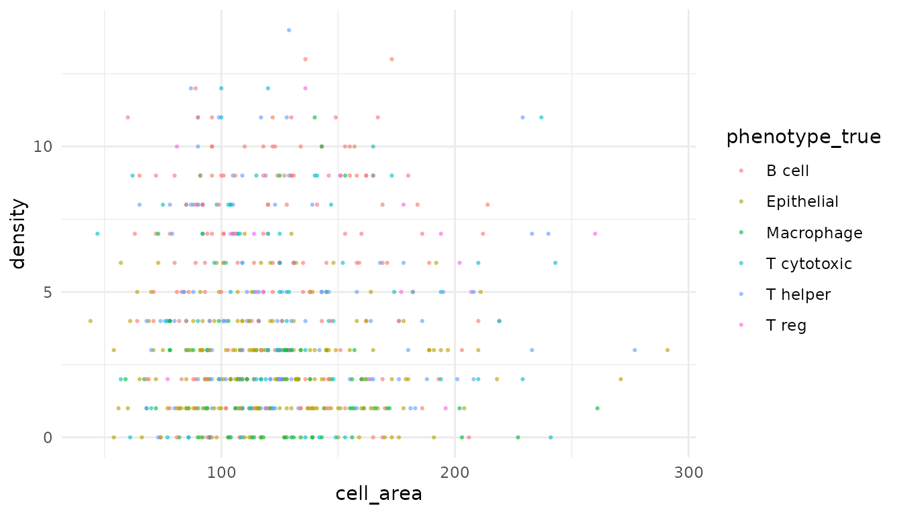
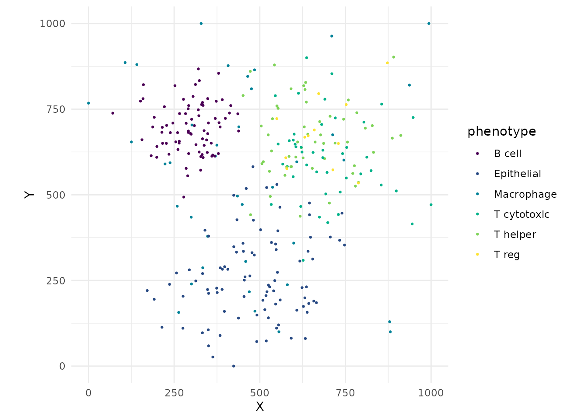
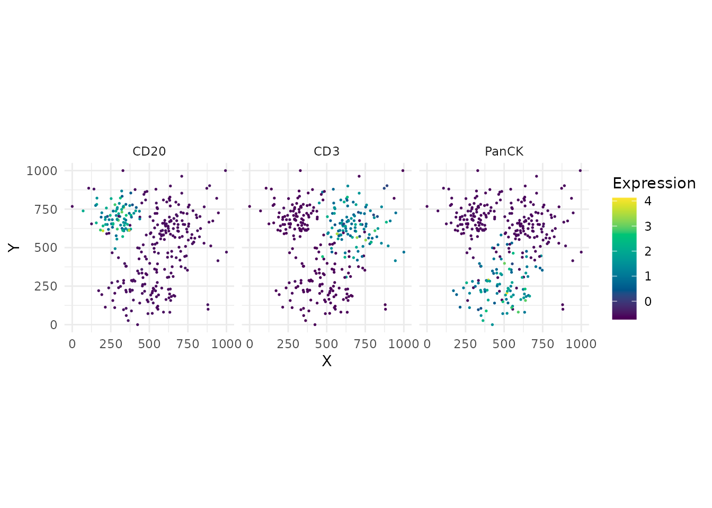
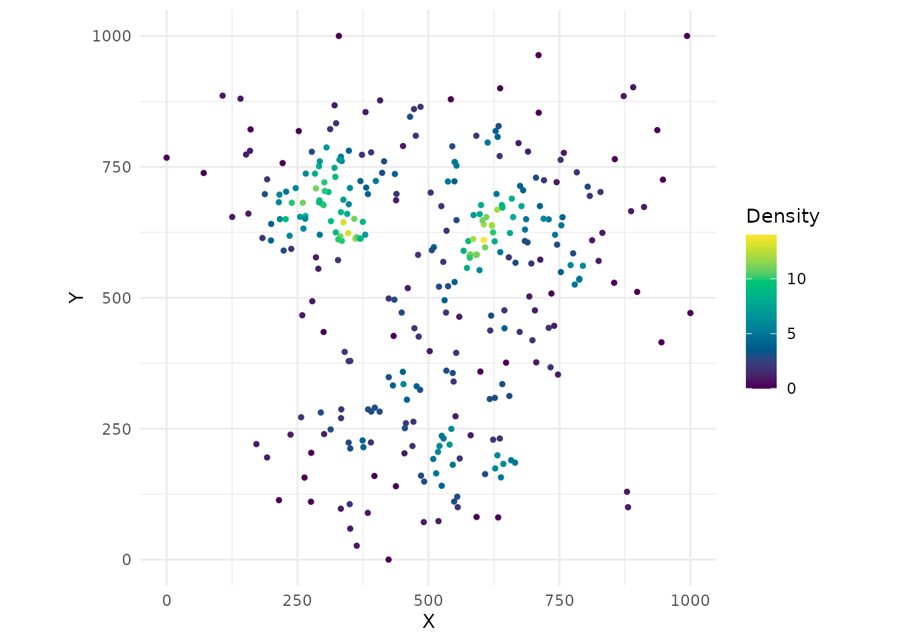
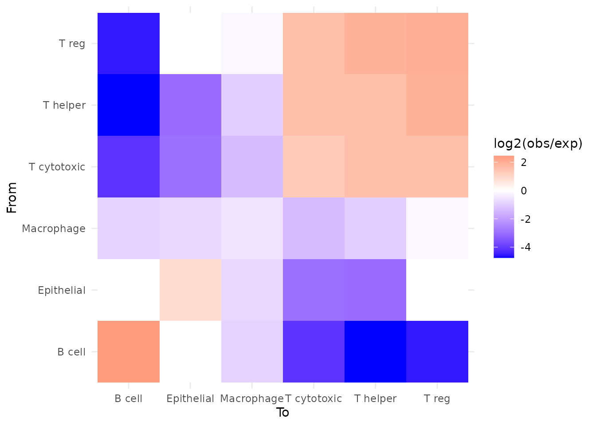
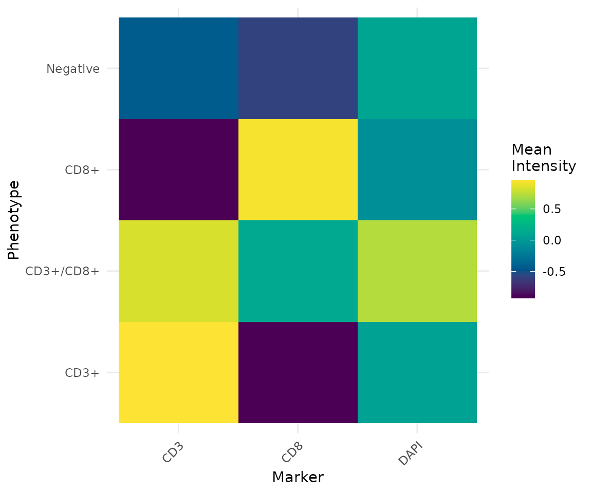

# Getting Started with phenoscapR

[](https://github.com/CTTIR/phenoscapR/actions/workflows/R-CMD-check.yaml)
[](https://cttir.github.io/phenoscapR/)
[](https://CRAN.R-project.org/package=phenoscapR)
[](https://app.codecov.io/gh/CTTIR/phenoscapR?branch=main)
[](https://cran.r-project.org/package=phenoscapR)
[](https://cran.r-project.org/package=phenoscapR)
[](https://opensource.org/licenses/MIT)
[](https://lifecycle.r-lib.org/articles/stages.html#experimental)


[](https://github.com/cttir/phenoscapR/actions/workflows/R-CMD-check.yaml)
[](https://github.com/cttir/phenoscapR/actions/workflows/test-coverage.yaml)
[](https://github.com/cttir/phenoscapR/actions/workflows/lint.yaml)
[](https://app.codecov.io/gh/cttir/phenoscapR)

### Overview

**phenoscapR** takes you from a raw multiplexed-imaging
cell-segmentation table all the way to publication-ready spatial
statistics and figures. The workflow mirrors the way single-cell
analysts already think:

1.  **Read** segmentation output into a `SpatialCellData` object
2.  **Quality-control** cells by area and intensity
3.  **Normalise** marker intensities
4.  **Phenotype** cells from marker thresholds
5.  **Analyse** the spatial arrangement of those phenotypes
6.  **Visualise** every step

Every function comes in two flavours: a high-level **S4 interface** that
takes and returns a `SpatialCellData` object (used throughout this
vignette), and a low-level **`data.table` interface**
([`read_spatial()`](https://cttir.github.io/phenoscapR/reference/read_spatial.md),
[`qc_filter()`](https://cttir.github.io/phenoscapR/reference/qc_filter.md),
…) for scripting. They share one compute engine, so results are
identical.

### The bundled example dataset

The package ships `phenoscapR_example`, a fully synthetic two-sample
tonsil assay with planted spatial niches (a B-cell follicle, an
overlapping T-cell zone, an epithelial region, and scattered
macrophages). It lets every example here run without downloading
anything.

``` r

library(phenoscapR)
data(phenoscapR_example)

phenoscapR_example
#> A SpatialCellData object
#>   640 cells across 2 samples
#>   Markers: CD3, CD4, CD8, CD20, CD68, ... (8 total) 
#>   Normalised: FALSE 
#>   Project: phenoscapR example (tonsil, simulated)
```

It carries 640 cells across two samples and eight markers, plus a
`phenotype_true` column recording the ground-truth population of each
cell:

``` r

table(phenoscapR_example$sample_id, phenoscapR_example$phenotype_true)
#>           
#>            B cell Epithelial Macrophage T cytotoxic T helper T reg
#>   tonsil_A     80         90         38          45       55    12
#>   tonsil_B     80         90         38          45       55    12
```

> **Reading your own data.** In practice you would start from
> `ReadSpatial("segmentation.csv")` (or a directory of CSVs). phenoscapR
> auto-detects QuPath full/minimal exports and flat segmentation tables.
> See
> [`vignette("phenoscapR-02-object-model")`](https://cttir.github.io/phenoscapR/articles/phenoscapR-02-object-model.md)
> for the object model and import details.

### 1. Quality control

[`QCFilter()`](https://cttir.github.io/phenoscapR/reference/QCFilter.md)
removes implausibly small or large cells and, optionally, cells outside
an intensity band. We work on a copy so the original stays intact.

``` r

obj <- QCFilter(phenoscapR_example, min_area = 20, max_area = 1000)
obj
#> A SpatialCellData object
#>   640 cells across 2 samples
#>   Markers: CD3, CD4, CD8, CD20, CD68, ... (8 total) 
#>   Normalised: FALSE 
#>   Project: phenoscapR example (tonsil, simulated)
```

Use [`QCPlot()`](https://cttir.github.io/phenoscapR/reference/QCPlot.md)
to inspect what was kept against any two metadata columns:

``` r

obj <- CellDensity(obj, radius = 40)
QCPlot(obj, x = "cell_area", y = "density", colour_by = "phenotype_true")
```



### 2. Normalisation

[`NormaliseData()`](https://cttir.github.io/phenoscapR/reference/NormaliseData.md)
rescales each marker. `"zscore"` centres and scales to unit variance;
`"minmax"` maps to `[0, 1]`; `"quantile"` is rank-based.

``` r

obj <- NormaliseData(obj, method = "zscore")
round(GetData(obj)[1:4, ], 2)
#>        CD3   CD4   CD8  CD20  CD68 PanCK FoxP3  Ki67
#> [1,] -0.66 -0.36 -0.27  0.56 -0.36 -0.58 -0.28  0.31
#> [2,]  2.02 -0.30  2.96 -0.51 -0.36 -0.58 -0.10 -0.63
#> [3,] -0.67 -0.49 -0.37 -0.58 -0.38  0.72 -0.30  3.14
#> [4,] -0.59 -0.47 -0.39  2.10 -0.30 -0.61 -0.28  0.62
```

### 3. Phenotyping

Assign phenotypes by thresholding normalised markers. Because the data
are z-scored, a threshold of `1` means “at least one standard deviation
above the marker’s mean”.
[`PhenotypeCells()`](https://cttir.github.io/phenoscapR/reference/PhenotypeCells.md)
builds composite labels such as `CD3+/CD4+`.

``` r

obj <- PhenotypeCells(obj, thresholds = list(
  CD20 = 1, CD3 = 1, CD8 = 1, CD4 = 1, CD68 = 1, PanCK = 1, FoxP3 = 1
))
head(PhenotypeSummary(obj))
#>   sample_id   phenotype count proportion
#> 1  tonsil_A    Negative    53   0.165625
#> 2  tonsil_A   CD3+/CD8+    20   0.062500
#> 3  tonsil_A       CD20+    63   0.196875
#> 4  tonsil_A       CD68+    36   0.112500
#> 5  tonsil_A        CD3+    11   0.034375
#> 6  tonsil_A CD4+/FoxP3+     6   0.018750
```

For the rest of this vignette we use the curated ground-truth
populations so the figures stay easy to read:

``` r

obj@meta_data$phenotype <- obj@meta_data$phenotype_true
```

[`CompositionPlot()`](https://cttir.github.io/phenoscapR/reference/CompositionPlot.md)
shows phenotype proportions per sample:

``` r

CompositionPlot(obj, group_by = "sample_id")
```


### 4. The phenotype map

[`CellMap()`](https://cttir.github.io/phenoscapR/reference/CellMap.md)
is the workhorse plot — every cell drawn at its tissue position,
coloured by phenotype. Spatial structure (the follicle, the T-cell zone)
is immediately visible.

``` r

tonsil_a <- obj[obj$sample_id == "tonsil_A", ]
CellMap(tonsil_a)
```



Colour instead by a continuous marker with
[`FeaturePlot()`](https://cttir.github.io/phenoscapR/reference/FeaturePlot.md):

``` r

FeaturePlot(tonsil_a, features = c("CD20", "CD3", "PanCK"))
```



### 5. Spatial analysis

#### Local density and nearest neighbours

``` r

obj <- FindNeighbours(obj, k = 5)
summary(Meta(obj)$nn_distance)
#>    Min. 1st Qu.  Median    Mean 3rd Qu.    Max. 
#>   9.245  25.714  35.035  41.044  48.368 209.678

DensityPlot(tonsil_a <- CellDensity(tonsil_a, radius = 40))
```



#### Phenotype interactions

[`InteractionMatrix()`](https://cttir.github.io/phenoscapR/reference/InteractionMatrix.md)
counts, per sample, how often each phenotype pair sits within `radius`
of one another versus what random mixing would predict. The score is
`log2(observed / expected)` — positive means attraction, negative means
avoidance. Neighbours are **never** counted across samples.

``` r

im <- InteractionMatrix(obj, radius = 40)
head(im[order(-im$interaction_score), ])
#> <phenoscapR> Phenotype interaction matrix
#>   4 phenotypes; score = log2(observed / expected)
#>   strongest attractions:
#>         from       to interaction_score
#>       B cell   B cell          2.446922
#>        T reg    T reg          1.990115
#>     T helper    T reg          1.893254
#>        T reg T helper          1.893254
#>  T cytotoxic T helper          1.579319

InteractionPlot(im)
```



#### Marker signatures per phenotype

``` r

MarkerHeatmap(obj)
```



### Where to next

phenoscapR has much more spatial machinery — Ripley’s K, Moran’s I,
neighbourhood-enrichment permutation tests, the pair correlation
function, Delaunay contact graphs — and a full gallery of plots and
dimensionality reductions.

| Vignette | Focus |
|----|----|
| [The SpatialCellData Object](https://cttir.github.io/phenoscapR/articles/phenoscapR-02-object-model.md) | class internals, import, accessors, subsetting |
| [Advanced Spatial Analysis](https://cttir.github.io/phenoscapR/articles/phenoscapR-03-spatial-analysis.md) | Ripley’s K, Moran’s I, enrichment, choosing a statistic |
| [Visualisation Gallery](https://cttir.github.io/phenoscapR/articles/phenoscapR-04-visualisation.md) | every plotting function, side by side |

## Use of LLM tools

Portions of this package were prepared with assistance from large
language model tooling for narrowly defined, non-authorial tasks:
copyediting, prose smoothing, Markdown/LaTeX formatting, scaffolding of
boilerplate files (CI configs, build scripts), code refactoring. The
tools used were [Chat
AI](https://kisski.gwdg.de/leistungen/2-02-llm-service/), the LLM
service of KISSKI (GWDG), and a self-hosted **Mistral Small (24B,
Apache-2.0)** run locally via [Ollama](https://ollama.com/) and the
`ollamar` R package — local inference only, with no data sent to third
parties for the self-hosted model.

All scientific claims, methodological choices, analyses,
interpretations, and conclusions are the author’s own. No LLM-generated
text was incorporated without review and revision, and every reference
was verified against its DOI, arXiv ID, or ISBN.
