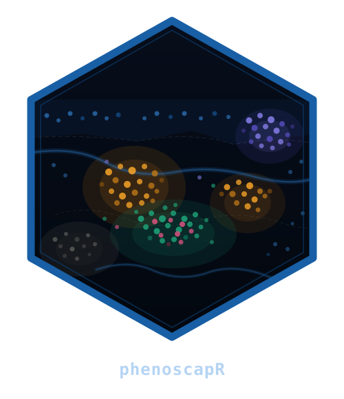

# The SpatialCellData Object



## Overview

The **`SpatialCellData`** S4 class is the central data container in
phenoscapR. It stores all information about a spatial biology experiment
in a single object:

| Slot | Type | Contents |
|----|----|----|
| `counts` | numeric matrix | Raw marker intensities (cells × markers) |
| `data` | numeric matrix | Normalised intensities (filled by [`NormaliseData()`](https://r-heller.github.io/phenoscapR/reference/NormaliseData.md)) |
| `coords` | data.frame | Spatial coordinates (`x`, `y` columns) |
| `meta_data` | data.frame | Per-cell metadata (phenotype, sample ID, QC flags, …) |
| `project` | character | Project / experiment name |
| `spatial` | list | Results from spatial analysis functions |

This vignette walks through constructing, inspecting, and subsetting a
`SpatialCellData` object.

## Construction

### From raw matrices

Use
[`CreateSpatialObject()`](https://r-heller.github.io/phenoscapR/reference/CreateSpatialObject.md)
when you already have a counts matrix and a coordinates table:

``` r
library(phenoscapR)

set.seed(1)
n <- 200

counts <- matrix(
  abs(rnorm(n * 4, mean = 500, sd = 200)),
  nrow = n,
  dimnames = list(NULL, c("CD3", "CD8", "CD20", "PanCK"))
)

coords <- data.frame(
  x = runif(n, 0, 1000),
  y = runif(n, 0, 1000)
)

obj <- CreateSpatialObject(counts, coords, project = "demo")
obj
#> A SpatialCellData object
#>   200 cells across 1 sample
#>   Markers: CD3, CD8, CD20, PanCK 
#>   Normalised: FALSE 
#>   Project: demo
```

### From CSV files

Use
[`ReadSpatial()`](https://r-heller.github.io/phenoscapR/reference/ReadSpatial.md)
to read one or more CSV files and return a `SpatialCellData` object
directly:

``` r
obj <- ReadSpatial("path/to/segmentation.csv", sample_id = "sample1")

# Or read a whole directory
obj <- ReadSpatial("path/to/csv_dir/")
```

## Inspecting the Object

``` r
# Dimensions: cells × markers
dim(obj)
#> [1] 200   4

# Cell count and marker names
NCells(obj)
#> [1] 200
NMarkers(obj)
#> [1] 4
Markers(obj)
#> [1] "CD3"   "CD8"   "CD20"  "PanCK"

# First few rows of metadata
head(Meta(obj))
#>   cell_id sample_id
#> 1       1   sample1
#> 2       2   sample1
#> 3       3   sample1
#> 4       4   sample1
#> 5       5   sample1
#> 6       6   sample1

# First few rows of coordinates
head(Coords(obj))
#>           x         y
#> 1 138.53856  61.60942
#> 2  47.52457 355.32135
#> 3  33.91887 577.03775
#> 4 916.08902 535.03156
#> 5 840.20039 604.27283
#> 6 178.87142 486.14898
```

## Accessing Expression Data

``` r
# Raw counts
raw <- GetData(obj, slot = "counts")
raw[1:3, ]
#>           CD3      CD8     CD20    PanCK
#> [1,] 374.7092 581.8804 714.8882 431.7866
#> [2,] 536.7287 837.7747 879.1310 800.4849
#> [3,] 332.8743 817.3177 379.4005 605.6615

# After normalisation, use slot = "data"
obj <- NormaliseData(obj, method = "zscore")
norm <- GetData(obj, slot = "data")
norm[1:3, ]
#>             CD3       CD8      CD20      PanCK
#> [1,] -0.7125125 0.3645126  1.050439 -0.2286880
#> [2,]  0.1594060 1.6459558  1.826956  1.4797676
#> [3,] -0.9376502 1.5435133 -0.535701  0.5770049
```

## Working with Metadata

Metadata columns are accessible with `$` and `[[`:

``` r
# After phenotyping
obj <- PhenotypeCells(obj, thresholds = list(CD3 = 0, CD8 = 0,
                                              CD20 = 0, PanCK = 0))
head(obj$phenotype)
#> [1] "CD8+/CD20+"             "CD3+/CD8+/CD20+/PanCK+" "CD8+/PanCK+"           
#> [4] "CD3+/PanCK+"            "CD3+"                   "CD8+"
head(obj[["sample_id"]])
#> [1] "sample1" "sample1" "sample1" "sample1" "sample1" "sample1"
```

[`Idents()`](https://r-heller.github.io/phenoscapR/reference/Idents.md)
returns the active identity — phenotype labels if set, otherwise sample
identities:

``` r
table(Idents(obj))
#> 
#>                  CD20+           CD20+/PanCK+                   CD3+ 
#>                     13                     14                     15 
#>             CD3+/CD20+      CD3+/CD20+/PanCK+              CD3+/CD8+ 
#>                     13                     12                     10 
#>        CD3+/CD8+/CD20+ CD3+/CD8+/CD20+/PanCK+       CD3+/CD8+/PanCK+ 
#>                      7                     10                     14 
#>            CD3+/PanCK+                   CD8+             CD8+/CD20+ 
#>                     10                     12                     16 
#>      CD8+/CD20+/PanCK+            CD8+/PanCK+               Negative 
#>                     12                     17                     15 
#>                 PanCK+ 
#>                     10
```

## Subsetting

`SpatialCellData` supports standard R subsetting with `[`:

``` r
# Keep only CD3+ T cells
t_cells <- obj[obj$phenotype == "CD3+CD8-", ]
NCells(t_cells)
#> [1] 0
dim(t_cells)
#> [1] 0 4
```

## Next Steps

- **[Getting
  Started](https://r-heller.github.io/phenoscapR/articles/phenoscapR.md)**
  — end-to-end workflow with the low-level data.table API
- **[Advanced Spatial
  Analysis](https://r-heller.github.io/phenoscapR/articles/phenoscapR-03-spatial-analysis.md)**
  — Ripley’s K, neighbourhood enrichment, Moran’s I, and more
