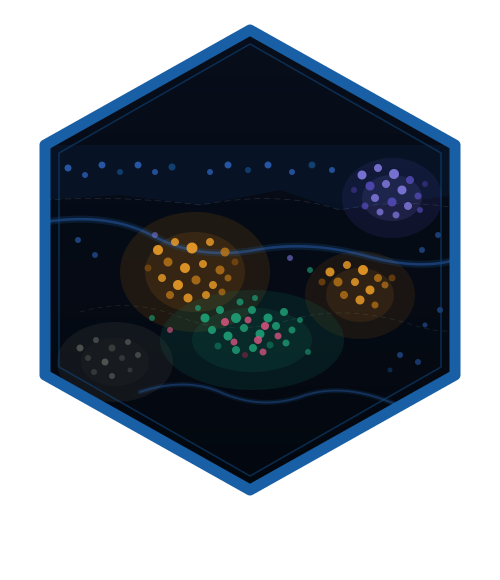

```{r setup, include = FALSE}
knitr::opts_chunk$set(
  collapse = TRUE,
  comment = "#>",
  fig.width = 7,
  fig.height = 5,
  dpi = 96
)
```



## Overview

**phenoscapR** takes you from a raw multiplexed-imaging cell-segmentation table
all the way to publication-ready spatial statistics and figures. The workflow
mirrors the way single-cell analysts already think:

1. **Read** segmentation output into a `SpatialCellData` object
2. **Quality-control** cells by area and intensity
3. **Normalise** marker intensities
4. **Phenotype** cells from marker thresholds
5. **Analyse** the spatial arrangement of those phenotypes
6. **Visualise** every step

Every function comes in two flavours: a high-level **S4 interface** that takes
and returns a `SpatialCellData` object (used throughout this vignette), and a
low-level **`data.table` interface** (`read_spatial()`, `qc_filter()`, …) for
scripting. They share one compute engine, so results are identical.

## The bundled example dataset

The package ships `phenoscapR_example`, a fully synthetic two-sample tonsil
assay with planted spatial niches (a B-cell follicle, an overlapping T-cell
zone, an epithelial region, and scattered macrophages). It lets every example
here run without downloading anything.

```{r data}
library(phenoscapR)
data(phenoscapR_example)

phenoscapR_example
```

It carries 640 cells across two samples and eight markers, plus a
`phenotype_true` column recording the ground-truth population of each cell:

```{r data-shape}
table(phenoscapR_example$sample_id, phenoscapR_example$phenotype_true)
```

> **Reading your own data.** In practice you would start from
> `ReadSpatial("segmentation.csv")` (or a directory of CSVs). phenoscapR
> auto-detects QuPath full/minimal exports and flat segmentation tables. See
> `vignette("phenoscapR-02-object-model")` for the object model and import
> details.

## 1. Quality control

`QCFilter()` removes implausibly small or large cells and, optionally, cells
outside an intensity band. We work on a copy so the original stays intact.

```{r qc}
obj <- QCFilter(phenoscapR_example, min_area = 20, max_area = 1000)
obj
```

Use `QCPlot()` to inspect what was kept against any two metadata columns:

```{r qcplot, fig.height = 4}
obj <- CellDensity(obj, radius = 40)
QCPlot(obj, x = "cell_area", y = "density", colour_by = "phenotype_true")
```

## 2. Normalisation

`NormaliseData()` rescales each marker. `"zscore"` centres and scales to unit
variance; `"minmax"` maps to `[0, 1]`; `"quantile"` is rank-based.

```{r normalise}
obj <- NormaliseData(obj, method = "zscore")
round(GetData(obj)[1:4, ], 2)
```

## 3. Phenotyping

Assign phenotypes by thresholding normalised markers. Because the data are
z-scored, a threshold of `1` means "at least one standard deviation above the
marker's mean". `PhenotypeCells()` builds composite labels such as `CD3+/CD4+`.

```{r phenotype}
obj <- PhenotypeCells(obj, thresholds = list(
  CD20 = 1, CD3 = 1, CD8 = 1, CD4 = 1, CD68 = 1, PanCK = 1, FoxP3 = 1
))
head(PhenotypeSummary(obj))
```

For the rest of this vignette we use the curated ground-truth populations so
the figures stay easy to read:

```{r use-truth}
obj@meta_data$phenotype <- obj@meta_data$phenotype_true
```

`CompositionPlot()` shows phenotype proportions per sample:

```{r composition, fig.height = 4}
CompositionPlot(obj, group_by = "sample_id")
```

## 4. The phenotype map

`CellMap()` is the workhorse plot — every cell drawn at its tissue position,
coloured by phenotype. Spatial structure (the follicle, the T-cell zone) is
immediately visible.

```{r cellmap}
tonsil_a <- obj[obj$sample_id == "tonsil_A", ]
CellMap(tonsil_a)
```

Colour instead by a continuous marker with `FeaturePlot()`:

```{r featureplot}
FeaturePlot(tonsil_a, features = c("CD20", "CD3", "PanCK"))
```

## 5. Spatial analysis

### Local density and nearest neighbours

```{r nn-density}
obj <- FindNeighbours(obj, k = 5)
summary(Meta(obj)$nn_distance)

DensityPlot(tonsil_a <- CellDensity(tonsil_a, radius = 40))
```

### Phenotype interactions

`InteractionMatrix()` counts, per sample, how often each phenotype pair sits
within `radius` of one another versus what random mixing would predict. The
score is `log2(observed / expected)` — positive means attraction, negative
means avoidance. Neighbours are **never** counted across samples.

```{r interactions}
im <- InteractionMatrix(obj, radius = 40)
head(im[order(-im$interaction_score), ])

InteractionPlot(im)
```

### Marker signatures per phenotype

```{r heatmap, fig.height = 5}
MarkerHeatmap(obj)
```

## Where to next

phenoscapR has much more spatial machinery — Ripley's K, Moran's I,
neighbourhood-enrichment permutation tests, the pair correlation function,
Delaunay contact graphs — and a full gallery of plots and dimensionality
reductions.

| Vignette | Focus |
|---|---|
| [The SpatialCellData Object](phenoscapR-02-object-model.html) | class internals, import, accessors, subsetting |
| [Advanced Spatial Analysis](phenoscapR-03-spatial-analysis.html) | Ripley's K, Moran's I, enrichment, choosing a statistic |
| [Visualisation Gallery](phenoscapR-04-visualisation.html) | every plotting function, side by side |

# Use of LLM tools

Portions of this package were prepared with assistance from large language model tooling for
narrowly defined, non-authorial tasks: copyediting, prose smoothing, Markdown/LaTeX formatting,
scaffolding of boilerplate files (CI configs, build scripts), code refactoring. The tools used were [Chat AI](https://kisski.gwdg.de/leistungen/2-02-llm-service/),
the LLM service of KISSKI (GWDG), and a self-hosted **Mistral Small (24B, Apache-2.0)** run locally via
[Ollama](https://ollama.com/) and the `ollamar` R package — local inference only, with no data sent to
third parties for the self-hosted model.

All scientific claims, methodological choices, analyses, interpretations, and conclusions are the
author's own. No LLM-generated text was incorporated without review and revision, and every reference
was verified against its DOI, arXiv ID, or ISBN.
